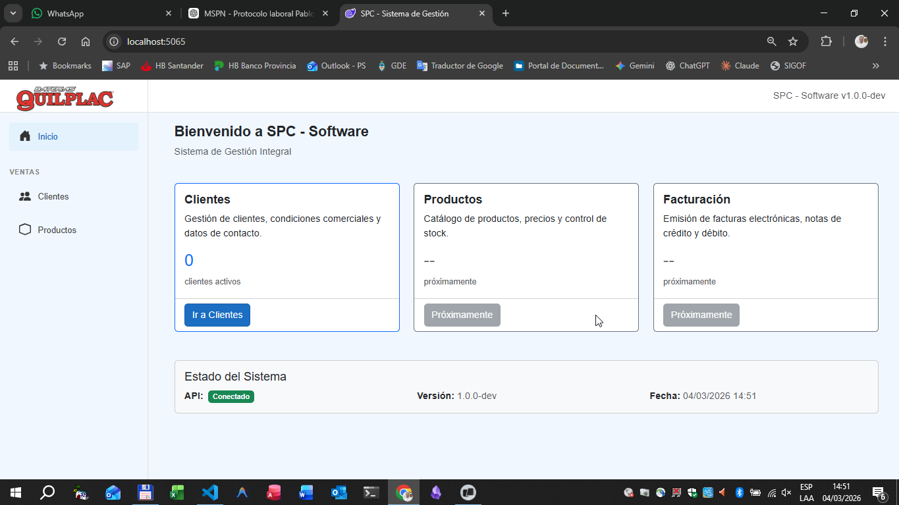

# SPC - Integral Management Software

[](https://dotnet.microsoft.com/)
[](https://blazor.net/)
[]()
[](LICENSE)

## Overview

SPC is an **ERP-style business management system** built with .NET and designed for real operational environments.

The project demonstrates the **modernization of a legacy VB6 + Microsoft Access system into a modern .NET architecture**, using ASP.NET Core, Blazor and Entity Framework Core.

The system manages real business processes such as **customers, invoicing, stock control, delivery management and financial accounts**, following modern backend and architectural practices.

---

## Why this project exists

This project was created to **modernize a real business management system originally developed in VB6** and used in operational environments.

The goal is to migrate the legacy architecture to a modern backend while preserving the existing business logic and improving:

- maintainability
- modularity
- scalability
- testing capabilities

---

## Key Capabilities

• Clean Architecture implementation  
• Minimal APIs backend design  
• Entity Framework Core data layer  
• Integration and unit testing with xUnit  
• Legacy system modernization strategy  
• Modular business logic and domain entities  

---

## Features

- **Customer Management**  
  Full CRUD with soft delete and multiple addresses.

- **Product Catalog**  
  Stock control across multiple warehouses.

- **Invoicing**  
  Electronic invoicing with ARCA integration (Argentina).

- **Delivery Notes**  
  Shipping management.

- **Quotes**  
  Budget generation.

- **Credit/Debit Notes**  
  Adjustments and corrections.

- **Current Accounts**  
  Customer balance tracking.

- **IIBB Withholdings**  
  ARBA integration (Buenos Aires province).

- **License System**  
  Modular feature licensing (Base / Premium / Enterprise).

---

## Tech Stack

| Layer | Technology |
|------|------------|
| Frontend | Blazor Server |
| Backend | ASP.NET Core 10 (Minimal APIs) |
| Database | SQLite (dev) / SQL Server (prod) |
| ORM | Entity Framework Core 10 |
| Auth | Windows Authentication |
| Testing | xUnit + FluentAssertions |

---

## Architecture

The project follows **Clean Architecture principles** with clear separation of concerns.

```

┌─────────────────────────────────────────────────────────────┐
│                      PRESENTATION                           │
│              (Blazor Pages, API Endpoints)                  │
├─────────────────────────────────────────────────────────────┤
│                      APPLICATION                            │
│                (Services, DTOs / Contracts)                 │
├─────────────────────────────────────────────────────────────┤
│                        DOMAIN                               │
│              (Entities in SPC.Shared)                       │
├─────────────────────────────────────────────────────────────┤
│                    INFRASTRUCTURE                           │
│              (EF Core, SPCDbContext)                        │
└─────────────────────────────────────────────────────────────┘

```

---

## Project Structure

```

spc-software/
├── SPC.API/                    # REST API backend
│   ├── Contracts/              # DTOs (Request/Response)
│   ├── Data/                   # Entity Framework context
│   ├── Endpoints/              # Minimal API endpoint modules
│   ├── Services/               # Business logic layer
│   └── Program.cs
│
├── SPC.Shared/                 # Shared domain models
│
├── SPC.Web/                    # Blazor Server frontend
│
├── SPC.Tests/                  # Test suite
│   ├── Integration/
│   └── Unit/
│
└── docs/                       # Documentation
├── adr/                    # Architecture Decision Records
└── *.md                    # Technical documentation

````

---

## Getting Started

### Prerequisites

- .NET 10 SDK  
- Visual Studio 2022 or VS Code  
- SQL Server (for production)

---

### Installation

```bash
git clone https://github.com/salamonepablo/spc-software.git
cd spc-software

dotnet restore
dotnet build
````

---

### Running the Application

**API (Backend)**

```bash
cd SPC.API
dotnet run
```

API available at:

```
https://localhost:5001
```

Swagger:

```
https://localhost:5001/swagger
```

---

**Web (Frontend)**

```bash
cd SPC.Web
dotnet run
```

Application available at:

```
https://localhost:5002
```

---

### Running Tests

Run all tests:

```bash
dotnet test
```

Run with detailed output:

```bash
dotnet test --logger "console;verbosity=detailed"
```

---

## API Endpoints

### Customers

| Method | Endpoint               | Description               |
| ------ | ---------------------- | ------------------------- |
| GET    | `/api/clientes`        | List all active customers |
| GET    | `/api/clientes/{id}`   | Get customer by ID        |
| GET    | `/api/clientes/buscar` | Search customers          |
| POST   | `/api/clientes`        | Create customer           |
| PUT    | `/api/clientes/{id}`   | Update customer           |
| DELETE | `/api/clientes/{id}`   | Soft delete               |

---

### Products

| Method | Endpoint                | Description     |
| ------ | ----------------------- | --------------- |
| GET    | `/api/productos`        | List products   |
| GET    | `/api/productos/{id}`   | Get product     |
| GET    | `/api/productos/buscar` | Search products |
| POST   | `/api/productos`        | Create product  |
| PUT    | `/api/productos/{id}`   | Update product  |

---

### Invoices (Facturas)

| Method | Endpoint                      | Description              |
| ------ | ----------------------------- | ------------------------ |
| GET    | `/api/facturas`               | List invoices            |
| GET    | `/api/facturas/{id}`          | Get invoice by ID        |
| GET    | `/api/facturas/buscar`        | Search invoices          |
| GET    | `/api/facturas/cliente/{id}`  | Get by customer          |
| GET    | `/api/facturas/fecha`         | Get by date range        |
| POST   | `/api/facturas`               | Create invoice           |
| POST   | `/api/facturas/{id}/anular`   | Void invoice             |

---

### Quotes (Presupuestos)

| Method | Endpoint                      | Description        |
| ------ | ----------------------------- | ------------------ |
| GET    | `/api/presupuestos`           | List quotes        |
| GET    | `/api/presupuestos/{id}`      | Get quote by ID    |
| POST   | `/api/presupuestos`           | Create quote       |
| POST   | `/api/presupuestos/{id}/anular` | Void quote      |

---

### Credit Notes (Notas de Crédito)

| Method | Endpoint                         | Description           |
| ------ | -------------------------------- | --------------------- |
| GET    | `/api/notas-credito`            | List credit notes     |
| GET    | `/api/notas-credito/{id}`       | Get credit note by ID |
| POST   | `/api/notas-credito`            | Create credit note    |
| POST   | `/api/notas-credito/{id}/anular` | Void credit note   |

---

### Debit Notes (Notas de Débito)

| Method | Endpoint                       | Description          |
| ------ | ------------------------------ | -------------------- |
| GET    | `/api/notas-debito`           | List debit notes     |
| GET    | `/api/notas-debito/{id}`      | Get debit note by ID |
| POST   | `/api/notas-debito`           | Create debit note    |
| POST   | `/api/notas-debito/{id}/anular` | Void debit note   |

---

## Architecture Decisions

Key architectural decisions are documented in **docs/adr**.

Examples:

* Minimal APIs vs Controllers
* Clean Architecture approach
* Soft Delete strategy
* Database strategy (SQLite dev / SQL Server prod)
* Modular licensing system

---

## Naming Convention

All internal code uses **English identifiers** for classes, properties, methods, and variables:

| Domain | Class Name | API Route (Spanish) |
|--------|------------|---------------------|
| Customers | `Customer` | `/api/clientes` |
| Products | `Product` | `/api/productos` |
| Invoices | `Invoice`, `InvoiceDetail` | `/api/facturas` |
| Quotes | `Quote`, `QuoteDetail` | `/api/presupuestos` |
| Credit Notes | `CreditNote`, `CreditNoteDetail` | `/api/notas-credito` |
| Debit Notes | `DebitNote`, `DebitNoteDetail` | `/api/notas-debito` |
| Delivery Notes | `DeliveryNote`, `DeliveryNoteDetail` | `/api/remitos` |
| Sales Reps | `SalesRep` | `/api/vendedores` |
| Warehouses | `Warehouse` | `/api/depositos` |
| Categories | `Category` | `/api/rubros` |

> **Note:** API routes remain in Spanish for backwards compatibility with existing integrations.

---

## Current Status

### Implemented

- REST API with full CRUD for Customers, Products
- Full CRUD for Invoices, Quotes, Credit Notes, Debit Notes
- Business rules: Invoice A vs B, IIBB perception, multi-level discounts, VAT immutability
- Blazor Server UI for Customer management (list, create, edit, delete)
- Clean Architecture with Services, DTOs and modular Endpoints
- Integration and Unit tests (111 tests passing)
- Architecture Decision Records (ADRs)
- CSV-based data migration tool with bulk inserts and skip logging
- **English naming convention** for all code identifiers (v0.2.0)

### In Progress

- Blazor UI for Products and Invoicing
- Stock management integration
- Current account updates on document creation

### Planned

- Authentication and role management
- Invoicing module with ARCA (AFIP) integration
- PDF generation with QR codes
- Docker deployment

---

## Screenshots

Init page


Customer list


---

## License

Proprietary – All rights reserved.

---

## Author

**Pablo Salamone**  
Software Developer  
GitHub: [https://github.com/salamonepablo](https://github.com/salamonepablo)

