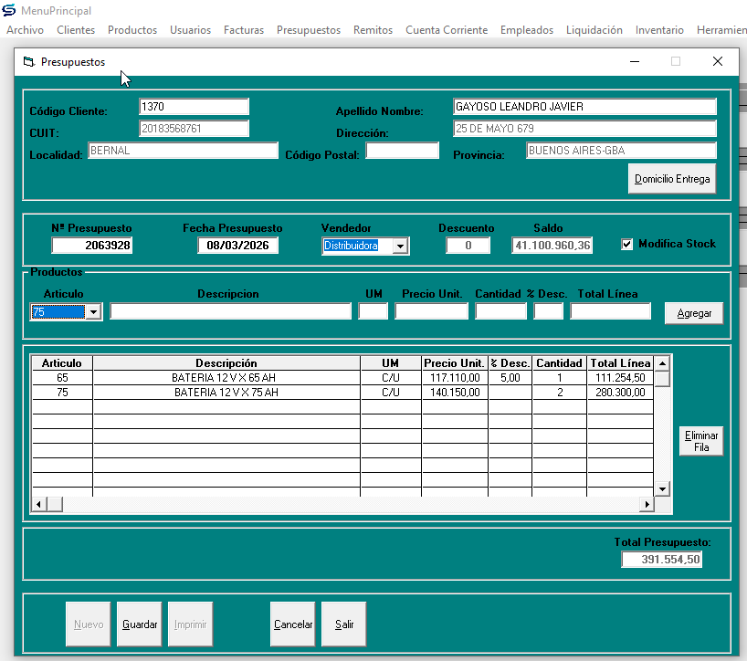
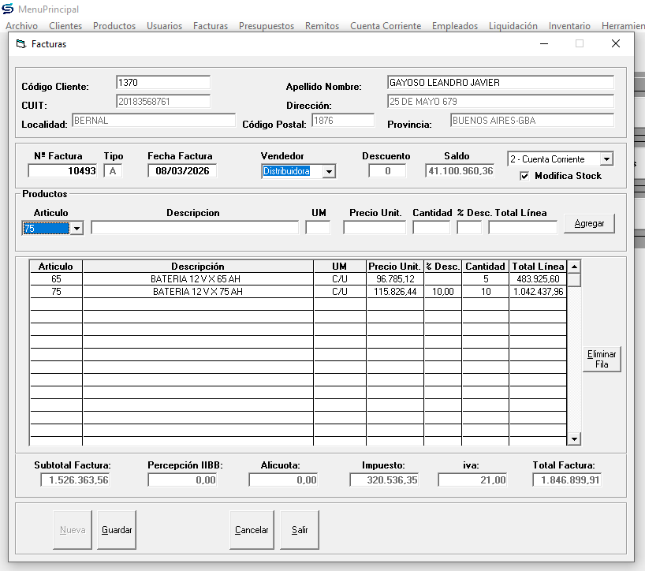

# SPC Software Project — Business Rules

## Context

You are working inside an existing .NET solution.

Main projects:

* **SPC.API** → ASP.NET Minimal API backend
* **SPC.Shared** → domain models (entities)
* **SPC.Tests** → xUnit unit + integration tests
* **SPC.Web** → Blazor UI
* **SPC.Migration** → migration tooling

Database stack:

* EF Core
* SQLite
* `SPCDbContext` located in `SPC.API/Data`

Existing infrastructure:

* Minimal APIs
* Integration test factory (`SPCWebApplicationFactory`)
* Licensing service
* Domain entities already defined in `SPC.Shared/Models`

Examples include:

* `Cliente`
* `Producto`
* `Factura`
* etc.

The solution builds and tests already run successfully.

---

# Objective

Implement CRUD endpoints for Invoices (Facturas), Credit Notes, Debit Notes, and Quotes (Presupuestos) with complete business rules for pricing, discounts, and VAT calculations.

---

# Pricing Business Rules

## Product Pricing Fields

Products have two distinct price fields:

* **Billing Price** (`PrecioFactura`) — used for invoices
* **Budget Price** (`PrecioPresupuesto`) — used for quotes

This dual-pricing strategy allows offering different prices per document type, enabling promotions or discounts on quotes without affecting regular invoice pricing.

## Price Calculation Convention

**Standard practice** (but not enforced):

Budget Price typically includes VAT, while Billing Price excludes it.

**Example:**
* Product budget price: **1210**
* Product billing price: **1000** (budget price minus 21% VAT)
* VAT rate: 21%

**Important:** This is a convention, not a hard rule. Users can modify prices independently based on business needs.

## VAT Must Be Configurable (No Code Changes)

VAT percentage must be adjustable without code modifications.

Preferred sources (in order):

* System initialization parameters (database-driven configuration)
* Configuration file (`appsettings*.json`) as fallback

Hardcoded VAT values (such as a fixed `21`) must not be used in invoice, credit note, debit note, or quote calculations.

### Suggested Design

* Add a configuration source for tax rates (for example: `TaxSettings` table or equivalent system-parameters table)
* Resolve VAT rate at runtime through a service (for example: `ITaxConfigurationService`)
* Persist the effective VAT percentage in document header (`VATPercent` / `PorcentajeIVA`) when the document is created, so historical documents remain immutable even if VAT changes later

### Migration Note

Legacy Access table `CondicionIva` appears to have been imported and is used for tax condition and invoice type mapping.
It should not be assumed to be a complete VAT-rate configuration source unless explicit rate fields exist.

## Discount and Surcharge System

The system provides multi-level pricing flexibility:

### 1. Customer-Level Discount

* Each customer (`Cliente`) has a default discount percentage field
* When creating an invoice or quote, this discount is pre-populated in the document header
* **User can override** this value per document

### 2. Document-Level Discount/Surcharge

* Applied at the header level (`FacturaC`, `PresupuestoC`, etc.)
* Affects the entire document total
* User can modify at invoice/quote creation time

### 3. Line-Level Discount/Surcharge

* Applied to individual detail lines (`FacturaD`, `PresupuestoD`, etc.)
* Each line can have specific discounts or surcharges
* **Most granular level** of pricing control

### Flexibility Principle

This multi-tier approach allows the system to adapt to various commercial scenarios and provide personalized pricing strategies per customer, document, or even product line.

---

# Document Types to Implement

Implement CRUD endpoints and business rules for:

| Document Type | Spanish Name | Base Route |
|---------------|--------------|------------|
| Invoices | Facturas | `/api/facturas` |
| Credit Notes | Notas de Crédito | `/api/notas-credito` |
| Debit Notes | Notas de Débito | `/api/notas-debito` |
| Quotes | Presupuestos | `/api/presupuestos` |

Each document follows the **Header/Detail pattern**:

* Header table (e.g., `FacturaC`) — document metadata, totals, customer, discounts
* Detail table (e.g., `FacturaD`) — line items with product, quantity, price, VAT, discounts

Budget example:


Invoice example:


---

# Implementation Requirements

### Follow Project Architecture

* Adhere to guidelines defined in `AGENTS.md`
* Implement business rules in service layer (`SPC.API/Services`)
* Keep endpoints thin (validation + service call)
* Use DTOs for all API contracts (`SPC.API/Contracts`)
* Maintain separation of concerns

### Service Responsibilities

Services must handle:

* Price calculations (including VAT, discounts, surcharges)
* VAT resolution from runtime configuration (not hardcoded constants)
* Validation of business rules
* Customer default discount application
* Line-level and document-level discount logic
* Total amount calculations
* Stock impact (for invoices and credit notes)

### Testing Requirements

* Add integration tests in `SPC.Tests/Integration`
* Cover all pricing scenarios:
  * Document with customer discount
  * Line-level discounts
  * Mixed discounts and surcharges
    * VAT change through configuration without recompiling
  * VAT calculations
  * Total amount verification
    * Historical document VAT immutability after tax-rate update
* Tests must validate business rule enforcement
* Ensure existing tests remain passing

---

# Architectural Constraints

### Program.cs must stay minimal

Do NOT implement endpoints directly in `Program.cs`.

Instead create endpoint modules.

Folder:

```
SPC.API/Endpoints
```

Files:

```
ClientesEndpoints.cs
ProductosEndpoints.cs
```

Each file must expose:

```
public static IEndpointRouteBuilder MapClientesEndpoints(this IEndpointRouteBuilder app)
```

and

```
public static IEndpointRouteBuilder MapProductosEndpoints(this IEndpointRouteBuilder app)
```

Program.cs should only call these methods.

---

# Service Layer

Business logic must NOT live in endpoints.

Create services inside:

```
SPC.API/Services
```

Files:

```
IClientesService.cs
ClientesService.cs

IProductosService.cs
ProductosService.cs
```

Responsibilities of services:

* database interaction
* business rules
* entity → DTO mapping
* validation if needed

Endpoints should only:

* receive request
* call service
* return HTTP result

---

# DTO Layer

Do NOT expose EF entities directly from the API.

Create DTOs in:

```
SPC.API/Contracts
```

Structure:

```
Contracts/
    Clientes/
        CreateClienteRequest.cs
        UpdateClienteRequest.cs
        ClienteResponse.cs

    Productos/
        CreateProductoRequest.cs
        UpdateProductoRequest.cs
        ProductoResponse.cs
```

DTO rules:

Request DTOs:

* used by POST / PUT

Response DTOs:

* returned by API

Entities from `SPC.Shared` must not be returned directly.

---

# Endpoints to Implement

## Clientes

Base route:

```
/api/clientes
```

Endpoints:

GET `/api/clientes/{id}`

GET `/api/clientes`

POST `/api/clientes`

PUT `/api/clientes/{id}`

Optional future extension:

DELETE or soft-delete.

---

## Productos

Base route:

```
/api/productos
```

Endpoints:

GET `/api/productos/{id}`

GET `/api/productos`

POST `/api/productos`

PUT `/api/productos/{id}`

---

# EF Core Integration

Use the existing DbContext:

```
SPC.API/Data/SPCDbContext.cs
```

Inject it into services.

Example pattern:

```
public class ClientesService : IClientesService
{
    private readonly SPCDbContext _db;

    public ClientesService(SPCDbContext db)
    {
        _db = db;
    }
}
```

Use async EF operations.

---

# Minimal API Structure Example

Endpoints should use grouping:

```
var group = app.MapGroup("/api/clientes")
               .WithTags("Clientes");
```

Return appropriate HTTP responses:

* 200 OK
* 201 Created
* 404 NotFound
* 400 BadRequest when applicable

---

# Integration Tests

Add tests in:

```
SPC.Tests/Integration
```

Files:

```
ClientesEndpointsTests.cs
ProductosEndpointsTests.cs
```

Use existing `SPCWebApplicationFactory`.

Minimum tests required:

Clientes:

* create cliente
* get cliente by id

Productos:

* create producto
* get producto by id

Tests must run using the in-memory or test database configuration already used by the project.

---

# Acceptance Criteria

The implementation is complete when:

* Solution builds successfully
* `dotnet test` passes
* CRUD endpoints work
* DTOs are used instead of EF entities
* Program.cs remains minimal
* Endpoints are separated into modules
* Services encapsulate business logic

---

# Important Constraints

Do NOT:

* break existing tests
* modify domain entities unnecessarily
* add heavy frameworks
* introduce complex patterns not already used in the project

Keep the implementation simple, readable, and idiomatic for ASP.NET Minimal APIs.
