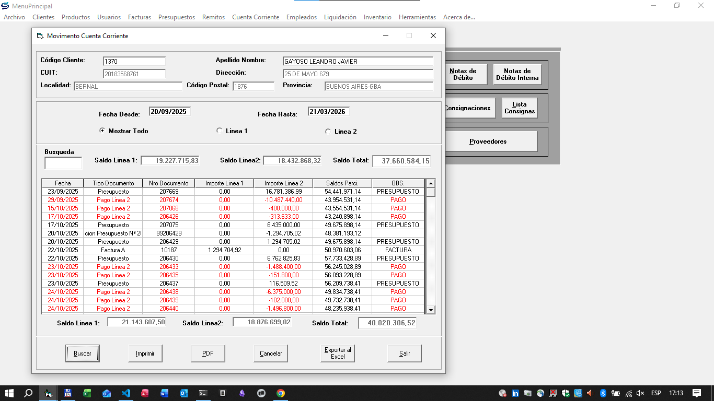
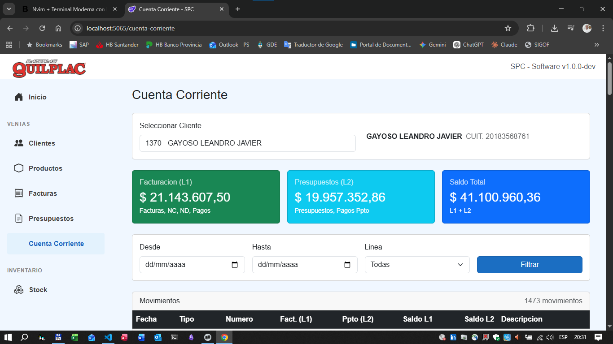

# SPC Software Project — Business Rules

## Context

You are working inside an existing .NET solution.

Main projects:

* **SPC.API** → ASP.NET Minimal API backend
* **SPC.Shared** → domain models (entities)
* **SPC.Tests** → xUnit unit + integration tests
* **SPC.Web** → Blazor UI
* **SPC.Migration** → migration tooling

Database stack:

* EF Core
* SQLite
* `SPCDbContext` located in `SPC.API/Data`

Existing infrastructure:

* Minimal APIs
* Integration test factory (`SPCWebApplicationFactory`)
* Licensing service
* Domain entities already defined in `SPC.Shared/Models`

Examples include:

* `Cliente`
* `Producto`
* `Factura`
* etc.

The solution builds and tests already run successfully.

---

# Objective

The current account view implementation is incomplete and does not fully reflect the business rules of the system. The goal of this task is to implement the missing business rules, in the current account view.

The current account view should reflect the following business rules:
* The order of movements must be ascending by date. The first movement should be the oldest. In most cases, the first movement will be the one identify as "Saldo inicial", and the next movements will be invoices, , quotes, paymantes credit notes, debit notes, etc. Showing the running balance after each movement is also required, because of that the order of movements must be maintained.
* The current account view must be able to show the balance at any point in time, not only the current balance. This means that the system must be able to calculate the balance at any point in time, taking into account all the movements that have occurred up to that point.
* As an example I left you the next image of the current account view, in the legacy software.:
    
* As you can see in the actual view of our system, the movements are not ordered by date, and the running balance is not correct, the numbers shown also are the same as the document shown. This makes it difficult for users to understand the current state of the account and to track the history of movements.

Then the card which belongs to the current account view it's not available, it says "Próximanente", and at the left menu it hasn't got the descript icon, the menu has only the name.

    The Current view, the banners or cards which show the L1 Balance, L2 Balance, and Total Balance, also are, I think, too big, they must be more compact, the fonts must be quite smaller as well, and the colors must be more neutral, perhaps the numbers in bold with different colors could be better. The movements table, also must be more compact, the fonts must be smaller, and the colors must be more neutral, perhaps with a different color for each type of movement (invoices, quotes, payments, credit notes, debit notes, etc.) could be better. The most important thing is that the movements must be ordered by date, and the running balance must be correct.
    ---

---

# Implementation Requirements

### Follow Project Architecture

* Adhere to guidelines defined in `AGENTS.md`, `CLAUDE.MD`, and `AGENT.md`
* Maintain separation of concerns:
  * Endpoints → minimal, only handle HTTP
  * Services → business logic, data access
  * DTOs → API contracts, no EF entities

### Testing Requirements

* Add integration tests in `SPC.Tests/Integration` for the Current Account endpoints.
* Cover all balance calculation scenarios:
  * Movements ordered strictly by date (ascending).
  * Running balance calculated correctly after each movement (invoices, payments, credit/debit notes).
  * Initial balance ("Saldo inicial") must be the first movement and correctly affect the running balance.
  * Correct separation and calculation of L1 and L2 balances.
* Tests must validate business rule enforcement for the chronological order and math accuracy.
* Ensure existing tests remain passing.

---

# Important Constraints

Do NOT:

* break existing tests
* modify domain entities unnecessarily
* add heavy frameworks
* introduce complex patterns not already used in the project

Keep the implementation simple, readable, and idiomatic for ASP.NET Minimal APIs.
